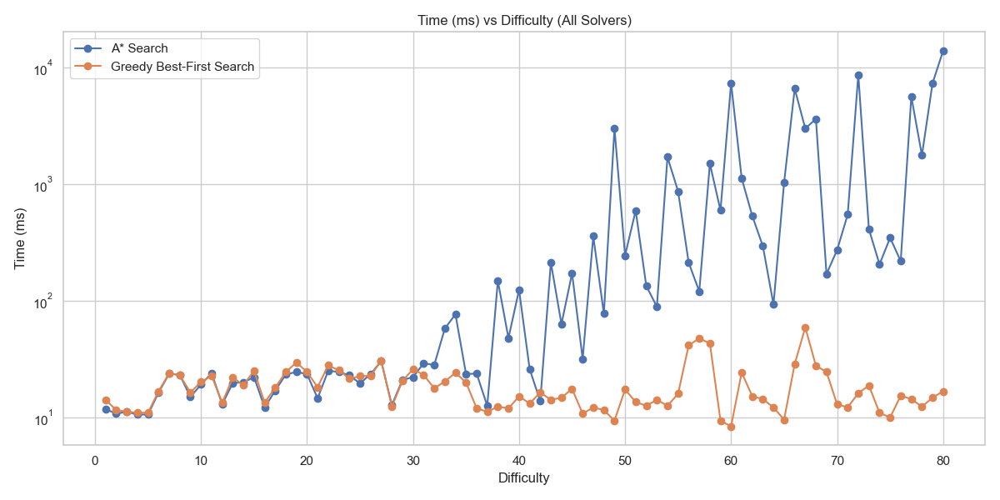
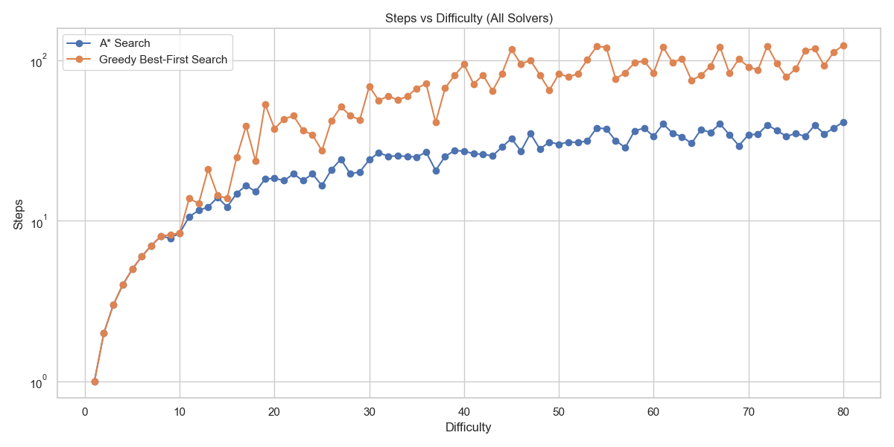
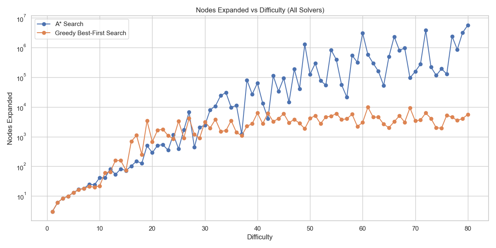

# 15-Puzzle Solver
## Algorithms and Analysis / Data Structure & Algorithms


### Nguyen Minh Anh - S4141357

### Vo Ngoc Dung S4124370

### Tang Hoang Ha S4147768 

### Tran Vinh Khang 3855823
This project is a Java-based solver for the classic 15-puzzle game, implemented as part of the **Algorithms and Analysis / Data Structures & Algorithms** course at **RMIT**.

The goal of this assignment is to apply informed search techniques to efficiently solve a 4x4 sliding tile puzzle. The solver is capable of using two popular pathfinding strategies:

- **A\* Search** — Combines actual cost and heuristic estimate to always find the optimal solution.
- **Greedy Best-First Search** — Prioritizes exploration based solely on heuristic value, trading optimality for speed.

## 🧠 Algorithm Overview
### 🔷 A* Search
A* is an informed search algorithm that finds the shortest path by combining:

g(n): the actual cost from the start node to the current node.

h(n): a heuristic estimate of the cost from the current node to the goal.

It minimizes:
f(n) = g(n) + h(n)

In this project, g(n) is the move cost (depth), and h(n) is the Manhattan distance of the puzzle tiles from their goal positions.

### 🔷 Greedy Best-First Search
Greedy Best-First Search only considers the heuristic:
f(n) = h(n)

It's usually faster than A*, but it does not guarantee the shortest solution, as it may get trapped in local minima.

## 🧩 entity Package Overview
The entity package contains the core classes that define puzzle behavior and data structures for solving it:


### 🔹 Node
Wraps a Board instance during search:

Stores path history, cost, parent node, and a unique order counter for tie-breaking

Calculates total f() score (used in A* and Greedy)

### 🔹 MinHeap
A custom priority queue used for node expansion:

Orders nodes based on f(n) for A*, or h(n) for Greedy

Maintains a binary heap to ensure efficient retrieval of the best node

### 🔹 VisitedSet
A high-performance custom hash set:

Prevents revisiting states by hashing board configurations

Implements open-addressing for fast lookup and dynamic resizing


## 🚀 How to Build & Run

### 1. Compile & Package

```bash
mvn clean package
```
### 2. Run the Solver
```bash
java -jar target/puzzle-solver-1.0.0.jar
```
This runs the app.PuzzleMain class as defined in your pom.xml.

## 📊 Benchmarking & Analysis
Performance data and visualizations are included in src/main/resources/:

CSV files of solver performance (solver_performance_regular.csv, etc.)

Python chart script: make_chart.py

Images comparing steps, time, and nodes expanded



## 🛠 Requirements
Java 17+ (you are using Java 24)


Maven 3.6+

For chart generation)
```bash
pandas
matplotlib
seaborn
```


